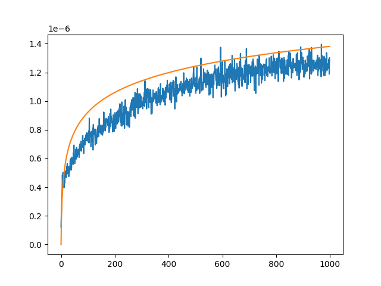

## Question 1

### In-Class Binary Search:

```python
bs(Arr, element):
	mid_index := floor(|Arr| / 2)
	x := Arr[mid_index]
	if x = element:
		return mid_index
	if x < element:
		return bs(Arr[ mid_index : |Arr| ], element)
	if x > element:
		return bs(Arr[ 1 : mid_index], element)
```

Bugs in this algorithm include:
- There is no negative base case (i.e. the value **must** be in the array, or the algorithm will never terminate)
- The index returned is an index **into a slice** of the original array. For example, for `bs([1, 2, 3, 4, 5, 6], 2)`, the algorithm will call `bs([1, 2, 3], 2)` to search the left half, but it will then return `1` because `([1, 2, 3])[1] == 2`.
- The first index (`0`) is never searched because the left-side slice starts at `1` 

### Our Binary Search:

```python
our_bs(Arr, element, istart, istop):
	if istart >= istop:
		the element is not in the array
	mid_index := floor((istart + istop) / 2)
	x := Arr[mid_index]
	if x = element:
		return mid_index
	if x < element:
		return our_bs(Arr, element, midpoint + 1, istop)
	if x > element:
		return our_bs(Arr, element, istart, midpoint)
```

This algorithm runs in $O(\log n)$ because each recursive iteration cuts the decision space in half. Either $\text{istart} := \text{midpoint + 1}$ or $\text{istop} := \text{midpoint}$ -- either way, the range between `istart` and `istop` is decreased by a factor of $\frac{1}{2}$


## Question 2

```python
def our_bs(arr, target, istart, istop):
    # Element is not in the array -> False
    if istart >= istop:
        return False
    
    # Assigning the midpoint to the average of the start and stop indices
    midpoint = (istart + istop) // 2
    
    # Assigning the value of the element at the midpoint to x
    x = arr[midpoint]
    
    # This is exactly the pseudo code with variable names changed to fit the rest of the code
    if x == target:
        return midpoint
    if x < target:
        return our_bs(arr, target, midpoint + 1, istop)
    if x > target:
        return our_bs(arr, target, istart, midpoint)
```

We tested the time of the binary search algorithm by creating a `for` loop that looped through every integer between 1 and 1000. For every loop, we created an array of length `n`, where `n` was the current integer in the loop and chose the target with a `random.choice()` of the array. We used Python's built-in `timeit.timeit()` function in order to get the time of 10000 runs, the result of which we divided by 10000 in order to get the average time. Overall, this means we timed every array length between 1 and 1000, 10000 times each and got the average time of each run, which was then plotted on the graph.

 

With time on the y-axis and size of input on the x-axis, our experimentally observed runtime (in blue) closely matches a logarithmic function (in orange). This indicates that our code runs in $O(n)$.


Our code can be found at https://github.com/chlohal/csci-160-hw1

## Question 3 

Write down the math to explain why the following code takes $O(n)$ run time.

```
for i = 0 to log(n):
	for j = 1 to n/(2^i):
		Do some constant work
```

---

$$
\begin{gather}
d(n) = \sum_{i=0}^{\log(n)} \sum_{j=1}^{\frac{n}{2^{i}}} 1 \\
d(n) = \sum_{i=0}^{\log(n)} \frac{n}{2^{i}} \\
d(n) = \sum_{i=0}^{\log(n)} n2^{-i} \\
d(n) = \sum_{i=0}^{\log(n)} n (0.5)^{i} \\
\text{Since } n 0.5^{i} \text{ is a geometric series} \\
\text{with a closed form of } \frac{n}{1 - 0.5}, \\
\lim_{ n \to \infty } \frac{d(n)}{n} = \lim_{ n \to \infty } \frac{\frac{n}{1 - 0.5}}{n} = C \therefore \\
\text{the tighest bound on runtime is }O(n)
\end{gather}
$$
